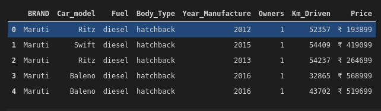

<!--
*** Thanks for checking out the Best-README-Template. If you have a suggestion
*** that would make this better, please fork the repo and create a pull request
*** or simply open an issue with the tag "enhancement".
*** Thanks again! Now go create something AMAZING! :D
-->


<!-- PROJECT SHIELDS -->
<!--
*** I'm using markdown "reference style" links for readability.
*** Reference links are enclosed in brackets [ ] instead of parentheses ( ).
*** See the bottom of this document for the declaration of the reference variables
*** for contributors-url, forks-url, etc. This is an optional, concise syntax you may use.
*** https://www.markdownguide.org/basic-syntax/#reference-style-links
-->

<!-- PROJECT LOGO -->
<br />
<p align="center">
    
  </a>

  <h3 align="center">Cars24 ScrapBot Using Multi-Processing</h3>

  <p align="center">
    Scrap Used Car Information efficiently
    <br />
    
   
  </p>
</p>

<!-- ABOUT THE PROJECT -->
## About The Project

Efficiently Scrap data from Cars24 Website.

Highlights:
* The engine uses multi-processing for reducing scraping time.
* Scrap multiple queries simulataneously.
* Data Dump and Cleaned Data Format are provided simulataneously.


### Built With

Automating Framework
* [Selenium](https://www.selenium.dev/)
* [Multiprocessing](https://docs.python.org/3/library/multiprocessing.html)

<!-- USAGE EXAMPLES -->
## Usage

1. Clone The Repository locally.

2. Satisfy the Requirements from requirements.txt

3. In the local dir,run the CLI
```sh
   python engine.py 
   ```

4. Fill the desired query.

5. Sit Back And Relax While The Engine Runs.

6. Find the Data Dump and Cleaned Data in dump and final_scraped dir respectively.

## Roadmap

1. Gain insights into the data.
2. Develop a Regressor Model accurately predicting the price of the used-cars.
3. Develop a Recommender Engine.


**The Website Schema May Change**\
**Last Tested Jan-2021**

*Stay Tuned*